# MagicPen


Create composable extensible styled text in both consoles and
browsers.

[](https://www.npmjs.com/package/magicpen)
[](https://travis-ci.org/sunesimonsen/magicpen)
[](https://coveralls.io/r/sunesimonsen/magicpen)
[](https://david-dm.org/sunesimonsen/magicpen)

## Installation

### Node

Install it with NPM or add it to your `package.json`:

```
$ npm install magicpen
```

Then:

```js
var magicpen = require('magicpen');
var pen = magicpen();
pen.red('Hello').sp().green('world!');
console.log(pen.toString('ansi'));
```

### Browser

Include `magicpen.js`.

```html
<script src="magicpen.js"></script>
```

this will expose the `magicpen` function under the following namespace:

```js
var magicpen = weknowhow.magicpen;
var pen = magicpen();
pen.red('Hello').sp().green('world!');
document.getElementById('output').innerHTML = pen.toString('html');
```

### RequireJS

Include the library with RequireJS the following way:

```js
require.config({
    paths: {
        magicpen: 'path/to/magicpen'
    }
});

define(['magicpen'], function (magicpen) {
    var pen = magicpen();
    pen.red('Hello').sp().green('world!');
    document.getElementById('output').innerHTML = pen.toString('html');
});
```

## Usage

You create a new `magicpen` instance by calling the `magicpen`
function. Then you can use methods on the instance to append content to
the output. Finally when you created the desired output you can
serialize it to plain `text`, `ansi` encoded text or `html`.

Let's try to create our first `magicpen` and serialize the output to
text to `ansi` encoding:

```js
var pen = magicpen();
pen.red('Hello').sp().green('world!');
console.log(pen.toString('ansi'));
```

The above snippet create a new `magicpen` and writes _Hello_ in red,
space and _world!_ in green and prints the formatted output to the
console. This will produce the following output:

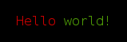

Let's try to create the same output but format it as html:

```js
var pen = magicpen();
pen.red('Hello').sp().green('world!');
document.getElementById('output').innerHTML = pen.toString('html');
```

You will get the following output it the browser:

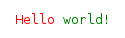

## API

### magicpen(options) or new MagicPen(options)

Creates a new instance of MagicPen with the given options.

Currently there is only two options: `indentationWidth` which defaults
to 2 and `format`.

Given magicpen a string is equivalent to specifying the format in the options object:

Specifying the format is useful in combination with the `alt` and `raw` methods.

Example:

```js
// Pen with indentation width 2
magicpen();
// Pen with indentation width 2 and in ansi format
magicpen('ansi');
// Pen with indentation width 4
magicpen({ indentationWidth: 4 });
```

### text(content, styleString...)

Append the given content to the output with the styles specified in the style strings.

#### Supported styles are:

*Text properties*:


*Foreground colors*:

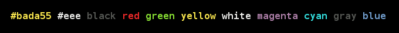

*Background colors*:

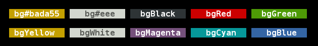

#### Example:

```js
var pen = magicpen();
pen.text('Hello', 'red')
   .text(' ')
   .text('colorful', 'yellow', 'bold')
   .text(' ')
   .text('world', 'green', 'underline')
   .text('!', 'bgYellow', 'blue');
console.log(pen.toString('ansi'));
```

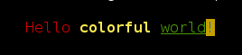

Notice that special characters might get escaped by this method. The
example below shows how special html characters is escaped by the html
format.

```js
var pen = magicpen();
pen.text('<strong>Hello world!</strong>');
expect(pen.toString('html'), 'to equal',
    '<div style="font-family: monospace; white-space: nowrap">\n' +
    '  <div>&lt;strong&gt;Hello&nbsp;world!&lt;/strong&gt;</div>\n' +
    '</div>');
```

When you use hex colors in the terminal the colors will be
approximated to the palette in use. The below images shows a limited
color sample in html and in a terminal supporting 256 colors.

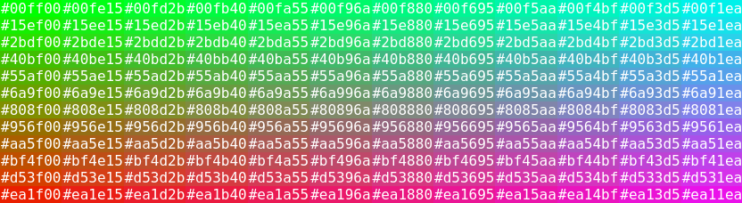

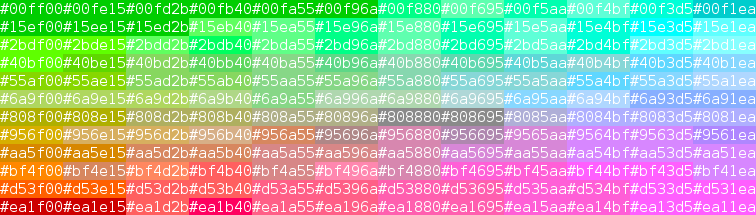

### toString([format])

Returns the content of the pen in the specified format.

Accepted formats are `text`, `ansi` and `html`.

It fails if the pen has another format set already.

If no format is specified, it will use the format of the pen or `text`
if the pen does not have a format set.

### newline(count = 1), nl(count = 1)

Starts the given number of new lines.

### Indentation

Example:

```js
pen.text('Hello').nl()
    .indentLines()
        .indent().text('beautiful').nl()
    .outdentLines()
    .text('world');
expect(pen.toString(), 'to equal',
    'Hello\n' +
    '  beautiful\n' +
    'world');
```

#### indentLines()

Increments the indentation level.

#### outdentLines()

Decrements the indentation level.

#### indent(), i()

Appends the indentation to the output.

#### indentationWidth

You can control the indentation size by setting `indentationWidth`
option when creating the pen.


```js
var pen = magicpen({ indentationWidth: 4 });
```

### append(pen), append(function())

Appends the content of the given pen to the end of this pen.

Example:

```js
var pen = magicpen();
var otherPen = pen.clone().text('world!');
pen.text('Hello').sp().append(otherPen);
expect(pen.toString(), 'to equal', 'Hello world!');
```

```js
var pen = magicpen();
pen.text('Hello').sp().append(function () {
    this.text('world!');
});
expect(pen.toString(), 'to equal', 'Hello world!');
```

### block(pen), block(function), block(style, arg...)

Appends the content of the given pen to the end of this pen in an
inline block.

Example:

```js
var pen = magicpen();
var otherPen = pen.clone()
    .text(' // This is a').nl()
    .text(' // multiline block');
pen.text('Text before block').block(otherPen);
expect(pen.toString(), 'to equal',
    'Text before block // This is a\n' +
    '                  // multiline block');
```

```js
var pen = magicpen();
pen.text('Text before block').block(function () {
    this.text(' // This is a').nl()
        .text(' // multiline block');
});
expect(pen.toString(), 'to equal',
    'Text before block // This is a\n' +
    '                  // multiline block');
```

```js
var pen = magicpen();
pen.red('Hello').block('text', ' // This is a\n // multiline comment');
expect(pen.toString(), 'to equal',
       'Hello // This is a\n' +
       '      // multiline comment');
```

### amend(pen), amend(function), amend(style, arg...)

Amends the content to the end of the pen.

Example:

```js
var pen = magicpen();
pen.block('text', 'This is a\n' +
                  'multiline block\n' +
                  'but you can still\n' +
                  'amend text to\n' +
                  'it');

pen.amend(pen.clone().text('!'));

expect(pen.toString(), 'to equal',
    'This is a\n' +
    'multiline block\n' +
    'but you can still\n' +
    'amend text to\n' +
    'it!');
```

```js
var pen = magicpen();
pen.block('text', 'This is a\n' +
                  'multiline block\n' +
                  'but you can still\n' +
                  'amend text to\n' +
                  'it');

pen.amend(function () {
    this.text('!');
});

expect(pen.toString(), 'to equal',
    'This is a\n' +
    'multiline block\n' +
    'but you can still\n' +
    'amend text to\n' +
    'it!');
```

```js
var pen = magicpen();
pen.block('text', 'This is a\n' +
                  'multiline block\n' +
                  'but you can still\n' +
                  'amend text to\n' +
                  'it');

pen.amend('text', '!');

expect(pen.toString(), 'to equal',
    'This is a\n' +
    'multiline block\n' +
    'but you can still\n' +
    'amend text to\n' +
    'it!');
```

### prependLinesWith(pen), prependLinesWith(function), prependLinesWith(style, arg...)

Prepends each line of this pen with the content of the given pen.

Example:

```js
var pen = magicpen();
var otherPen = pen.clone().text('> ');
pen.text('Line').nl()
   .text('after line').nl()
   .text('after line')
   .prependLinesWith(otherPen);
expect(pen.toString(), 'to equal',
    '> Line\n' +
    '> after line\n' +
    '> after line');
```

```js
var pen = magicpen();
pen.text('Line').nl()
   .text('after line').nl()
   .text('after line')
   .prependLinesWith(function () {
       this.text('> ');
   });
expect(pen.toString(), 'to equal',
    '> Line\n' +
    '> after line\n' +
    '> after line');
```

```js
var pen = magicpen();
pen.text('Line').nl()
   .text('after line').nl()
   .text('after line')
   .prependLinesWith('grey', '> ');
expect(pen.toString(), 'to equal',
    '> Line\n' +
    '> after line\n' +
    '> after line');
```

### size()

Returns the dimensions of the content of this pen.

Example:

```js
var pen = magicpen();
pen.text('First line').nl()
   .text('Second line');
expect(pen.size(), 'to equal', {
    height: 2,
    width: 11
});
```

### clone([format])

Returns a clone of the current pen with an empty output buffer. This
operation is very cheap, so don't hesitate to use it when it makes
sense.

If a format is given, the pen cloned pen will have that format. This
is useful in combination with the `alt` and `raw` methods. It will
fail if the format of the pen has already been set.

### addStyle(style, handler)

Defines a new style for the magicpen. The usage is best explained by
an example:

```js
var pen = magicpen();

pen.addStyle('rainbow', function (text, rainbowColors) {
    rainbowColors = rainbowColors ||
        ['gray', 'red', 'green', 'yellow', 'blue', 'magenta', 'cyan'];
    for (var i = 0; i < text.length; i += 1) {
        var color = rainbowColors[i % rainbowColors.length];
        this.text(text[i], color);
    }
});

pen.rainbow('The unicorns are flying low today').nl();
   .rainbow('The unicorns are flying low today', ['green', 'red', 'cyan']);
console.log(pen.toString('ansi'));
```


As you can see in the example above, a custom style can produce any
kind of output using an instance of a magicpen.

### removeFormatting()

Creates a new pen with the content of this pen where all text formatting is removed.

Example:

```js
var pen = magicpen();
pen.red('Hello').sp().green('world');
console.log(pen.toString('ansi'));
console.log(pen.removeFormatting().toString('ansi'));
```

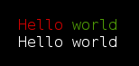

### alt(...)

If you need something completely custom, you can specify the actual
string content that will be used for each format. You can even output
raw content to the serializer.

Notice that you must specify the format of the pen before using this method
either at construction time or when cloning.

The format specific content can be of the following forms:

* A method that will append content to the pen bound to `this`.
* A method that will append to the pen given as the first parameter.
* An raw object of the following structure
  {
    width: <number>,
    height: <number>,
    content: <string function() {}|string>
  }
  If a method is given as the content it will be called at serialization time.
* A string, that will be appended in it's raw form into output with a
  size of zero.

If the format of the pen is not defined the fallback property will be
used. The fallback method can be specified the following way:

* A string, that will just be appended to the pen without styling.
* A method that will append content to the pen bound to `this`.
* A method that will append to the pen given as the first parameter.

```js
var pen = magicpen();
pen.addStyle('link', function (label, url) {
    this.alt({
        fallback: function () {
            this.text(label).sp().text('(').blue(url).text(')');
        },
        text: function () {
            this.text(label).sp().text('<').text(url).text('>');
        },
        html: {
            height: 1,
            width: label.length,
            content: '<a href="' + url + '" alt="' + label + '">' + label + '</a>'
        }
    });
});

pen.clone('text').link('magicpen', 'https://github.com/sunesimonsen/magicpen');
pen.clone('ansi').link('magicpen', 'https://github.com/sunesimonsen/magicpen');
pen.clone('html').link('magicpen', 'https://github.com/sunesimonsen/magicpen');
```

This will be the output in text mode:

```
magicpen <https://github.com/sunesimonsen/magicpen\x1B[39m>
```

This will be the output in ansi mode:

```
magicpen (\x1B[34mhttps://github.com/sunesimonsen/magicpen\x1B[39m)
```

This will be the output in html mode:

```
<div style="font-family: monospace; white-space: nowrap">
  <div><a href="https://github.com/sunesimonsen/magicpen" alt="magicpen">magicpen</a></div>
</div>
```

### raw(...)

In case you know the format of the pen you are working with, you can append
custom output directly to the serializer without any escaping.

Notice that you must specify the format of the pen before using this method
either at construction time or when cloning.

The raw content can have the following forms:

* An raw object of the following structure
  {
    width: <number>,
    height: <number>,
    content: <string function() {}|string>
  }
  If a method is given as the content it will be called at serialization time.
* A string, that will be appended in it's raw form into output with a
  size of zero.
* A function producing a string that will appended in it's raw form into output
  with a size of zero. The function will be called at serialization time.

```javascript
var pen = magicpen('html');
var label = 'magicpen';
var url = 'https://github.com/sunesimonsen/magicpen';

pen.raw({
  height: 1,
  width: label.length,
  content: '<a href="' + url + '" alt="' + label + '">' + label + '</a>'
}).nl();

pen.raw('<a href="' + url + '" alt="' + label + '">' + label + '</a>');

pen.raw(function () {
  return '<a href="' + url + '" alt="' + label + '">' + label + '</a>';
});
```

### isBlock()

Returns `true` if the output only contains a block.

```js
expect(magicpen().block(function () {
    this.text('foo');
}).isBlock(), 'to be true');
```

### isMultiline()

Returns `true` if the output more than one line.

```js
expect(magicpen().text('line 1').isMultiline(), 'to be false');
expect(magicpen().text('line 1\nline 2').isMultiline(), 'to be true');
```

### isAtStartOfLine()

Returns `true` if the "cursor" is located at the start of a line.

```js
expect(magicpen().text('line 1\n').isAtStartOfLine(), 'to be true');
expect(magicpen().text('line 1').isAtStartOfLine(), 'to be false');
```

### use(plugin)

MagicPen plugins are functions or objects that adhere to the following interface:

```js
{
  name: <optional plugin name>,
  dependencies: <an optional list of dependencies>,
  installInto: <a function that will update the given magicpen instance>
}
```

If a function is passed, it will be used like `installInto`, and the
name of the function will be used as the plugin name, unless the
function is anonymous.

The name of the plugin should be the same at the NPM package name.

A plugin can require a list of other plugins to be installed prior to
installation of the plugin. If the dependency list is not fulfilled
the installation will fail. The idea is that you manage your plugin
versions using NPM. If you install a plugin that is already installed
nothing will happen.

The `installInto` function receives an instance of `MagicPen` and uses
the `addStyle` method to add new custom styles to the `MagicPen`
instance.

```js
var pen = magicpen();
pen.use({
    name: 'starPlugin',
    installInto: function (pen) {
        pen.addStyle('stars', function (content) {
            this.text(String(content).replace(/./g, '*'));
        });
    }
);
pen.stars('secret');
expect(pen.toString(), 'to equal', '******');
```

### installTheme(theme), installTheme(format, theme), installTheme(formats, theme)

MagicPen has support for theming text styles differently for each format. A
number of theme properties together with a `styles` hash with aliases to built in
text styles or to aliases to other theme entries.

```js
pen.installTheme({
    styles: {
        keyword: 'yellow',
        functionName: ['green', 'italic'],
        primitive: '#FF8DFE',
        number: 'primitive'
    }
});
```

After installing the theme you get the following methods on the pen
`keyword`, `functionName` and `number`. If you wish to install the
theme after writing to the pen, you need to use the `text` method
instead: `pen.text('this uses the keyword style', 'keyword')`

Let's print some code with the pen:

```js
pen.keyword('function').sp().functionName('fib').text(' {').nl()
    .indentLines()
        .i().keyword('var').text(' i=0, fibs = [').number(0).text(', ').number(1)
            .text('];').nl()
        .i().keyword('for').text(' (; i < n; i += ').number(1).text(') {').nl()
        .indentLines()
            .i().text('fibs.push(fibs[').number(0).text('] + fibs[').number(1)
                .text(']);').nl()
            .i().text('fibs.shift();').nl()
        .outdentLines()
        .i().text('}').nl()
        .i().keyword('return').text(' fibs[').number(0).text('];').nl()
    .outdentLines()
    .text('}');
```

This will produce the following ansi output:

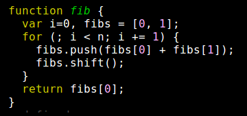

But these colors looks pretty lame on white background, which we
usually use when outputting to the html format:

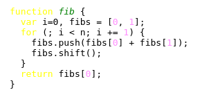

Let's tweak the html colors without touching the ansi colors:

```js
pen.installTheme('html', { styles: {
    keyword: 'bold',
    functionName: ['#403298', 'italic', 'bold'],
    primitive: '#80417F'
}});
```

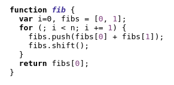

You can even extend the current theme:

```js
pen.installTheme('html', { styles: {
    functionName: ['#5B9832', 'bold']
}});
```

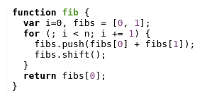

The theme is applied at serialization time, so you can extend the theme and
serialize again without touching the content of the pen.

## theme(), theme(format)

You can retrieve information about a theme the following way:

```js
pen.installTheme('html', {
    accentColors: ['#D50000', '#C51162', '#AA00FF'],
    styles: {}
});

pen.installTheme('ansi', {
    accentColors: ['#F44336', '#E91E63', '#9C27B0'],
    styles: {}
});

expect(pen.theme('html').accentColors,
       'to equal',
       ['#D50000', '#C51162', '#AA00FF']);

expect(pen.theme('ansi').accentColors,
       'to equal',
       ['#F44336', '#E91E63', '#9C27B0']);
```

Calling the `theme` method will return the theme for the given format. If the
format is not specified it will use the format of the pen.

Notice you need a `styles` property even when you don't specify any styles.

Let's use the accent colors define above to make a new style:

```js
pen.addStyle('colored', function (content) {
    var accentColors = this.theme().accentColors;
    var colorIndex = Math.round(Math.random() * (accentColors.length - 1));
    var color = accentColors[colorIndex];
    this.text(content, color);
});

console.log(pen.clone('ansi').colored('Colorful').toString());
```

The above style will color the given text with one of the accent colors of the
theme.

## Aliases

### space(count = 1), sp(count = 1)
Alias for `text(duplicate(' ', count))`.

### bold(content)
Alias for `text(content, 'bold')`.

### dim(content)
Alias for `text(content, 'dim')`.

### italic(content)
Alias for `text(content, 'italic')`.

### underline(content)
Alias for `text(content, 'underline')`.

### inverse(content)
Alias for `text(content, 'inverse')`.

### hidden(content)
Alias for `text(content, 'hidden')`.

### strikeThrough(content)
Alias for `text(content, 'strikeThrough')`.

### black(content)
Alias for `text(content, 'black')`.

### red(content)
Alias for `text(content, 'red')`.

### green(content)
Alias for `text(content, 'green')`.

### yellow(content)
Alias for `text(content, 'yellow')`.

### blue(content)
Alias for `text(content, 'blue')`.

### magenta(content)
Alias for `text(content, 'magenta')`.

### cyan(content)
Alias for `text(content, 'cyan')`.

### white(content)
Alias for `text(content, 'white')`.

### gray(content)
Alias for `text(content, 'gray')`.

### bgBlack(content)
Alias for `text(content, 'bgBlack')`.

### bgRed(content)
Alias for `text(content, 'bgRed')`.

### bgGreen(content)
Alias for `text(content, 'bgGreen')`.

### bgYellow(content)
Alias for `text(content, 'bgYellow')`.

### bgBlue(content)
Alias for `text(content, 'bgBlue')`.

### bgMagenta(content)
Alias for `text(content, 'bgMagenta')`.

### bgCyan(content)
Alias for `text(content, 'bgCyan')`.

### bgWhite(content)
Alias for `text(content, 'bgWhite')`.

## License

MIT, see the `LICENSE` file for details.
